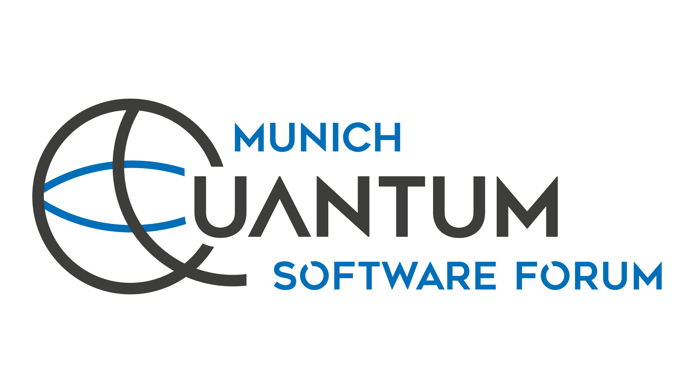

<p align="center">
  <a href="https://munich-quantum-software.github.io/mqsf/">
    <picture>
      <source media="(prefers-color-scheme: dark)" srcset="assets/images/brand/mqsf-logo-on-white.png">
      
    </picture>
  </a>
</p>

# Munich Quantum Software Forum

The MQSF event website, programs, and edition-specific materials. Plain HTML,
CSS, and JavaScript are served directly by GitHub Pages; no frontend build is required.

Use [the corporate identity guide](BRAND.md) when editing or adding pages.
Download or copy MQSF artwork from the [logos page](https://munich-quantum-software.github.io/mqsf/logos/).

## Layout

```text
2026/
  index.html          Event landing page
  event.css, event.js  Landing-page presentation and interactions
  program/            Program, speaker details, and software pitches
  meetups/            2026 calendar client and conference configuration
  assets/event/       Edition branding, photos, and thumbnails
  assets/sponsors/    Sponsor logos and the sponsor wall
  assets/organizers/  Organizer logos
  assets/speakers/    Speaker portraits and source artwork
  materials/          Downloadable event materials
assets/               Shared brand images, licensed fonts, and wave animation
logos/                Edition-independent logo previews and downloads
background/           Standalone animated background
backend/              Local calendar preview and tests
cloudflare/           Production calendar Worker, database migrations, and tests
```

The root opens the current edition. All content uses year-specific URLs; there
are no legacy page aliases.

## Local development

Use Node.js 22 or newer and Python 3.10 or newer through uv:

```sh
npm ci
uv run --no-project python backend/server.py --demo --port 8030
```

Open <http://127.0.0.1:8030/2026/> for the event page,
<http://127.0.0.1:8030/2026/program/> for the program, or
<http://127.0.0.1:8030/background/> for the animation.
The logos page is at <http://127.0.0.1:8030/logos/>.
The demo calendar uses a local SQLite database, not production data.
See [the preview guide](backend/README.md) for organizer testing and storage.

```sh
npm test
uv run --no-project python backend/check.py
```

These checks cover the calendar API, layout, moved page assets, and the current-edition
entry point. No tests write to the production database.

GitHub Actions also runs these checks for PRs and `main`. See
[PR preview setup](.github/PREVIEWS.md) for the one-time Pages configuration,
automatic preview links, and cleanup. Publishing is disabled until explicitly enabled.

## Editing and future editions

- Update speaker details in `2026/program/index.html` and pitches in
  `2026/program/script.js`. Session boundaries are explicit in `pitchSessionStarts`.
- Keep edition-specific images and downloads within that year's directory.
  Fonts retain their license in `assets/fonts/OFL.txt`.
- For a new edition, create its year directory from the existing pages, update
  content, dates, images, registration links, and calendar configuration, then
  change the root's event link and refresh destination to that edition.
- The calendar backend is still **2026-specific**. A future edition requires
  its own Worker/database and client API configuration. Do not repoint the 2026
  client or reset its database. See [the production calendar guide](cloudflare/README.md).
- Shared visual assets affect all editions. Preserve archived content and review
  older pages when changing shared assets.

## Publishing and migration

GitHub Pages continues to publish from the repository root. This restructuring
does not rename the repository, change Squarespace settings, or deploy the Worker.
See [migration notes](MIGRATION.md) before merging or renaming the repository.
